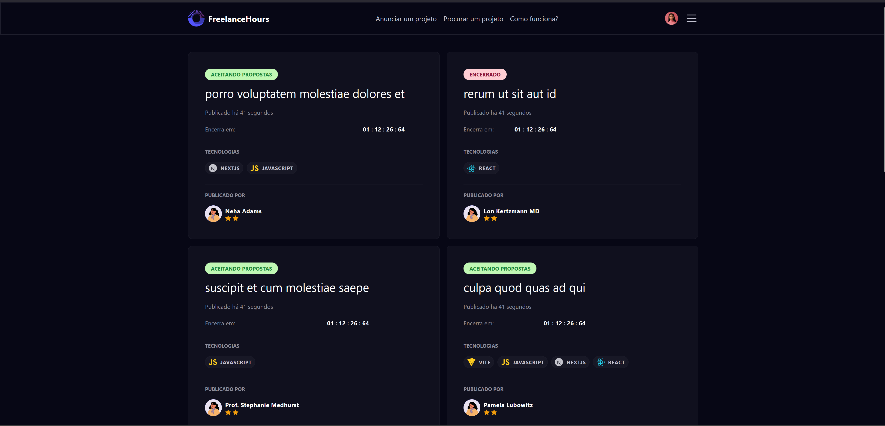

# FREELANCE HOURS
Aplicação Freelance Hours feito durante o curso gratuito de PHP da Rocketseat

<h1 align="center">
  
</h1>


<br>

## 💻 Tecnologias Utilizadas nesse Projeto
<div style="display: inline_block">
  
  
  
  
</div>

<br>

## Especificações/Versões
- Node: 20.17.0
- Laravel: 10
- PHP: 8.3
- Pacote de Gerenciamento de Dependências: NPM e ARTISAN
- Framework: Vite + React e Laravel + Blade


<br>
<br>
<br>
<br>


# Como usar o projeto

## 1ºPasso - Instalar as Dependências do package.json
```bash
$ npm install
```

<br>

## 2ºPasso - Instalar as Dependências do composer.json
```bash
$ composer install --no-dev
```

<br>

## 3ºPasso - Criar o arquivo do banco de dados
```bash
$ php artisan migrate
```

<br>

## 4ºPasso - Realizar o seed do banco de dados
```bash
$ php artisan migrate:fresh --seed
```

<br>

## 5ºPasso - Rodar o Projeto Vite
```bash
$ npm run dev
```

<br>

## 6ºPasso - Rodar o Projeto Laravel
```bash
$ npm run serve
```

<br>

## 7ºPasso - Abrir no Navegador o link
http://localhost:8000


